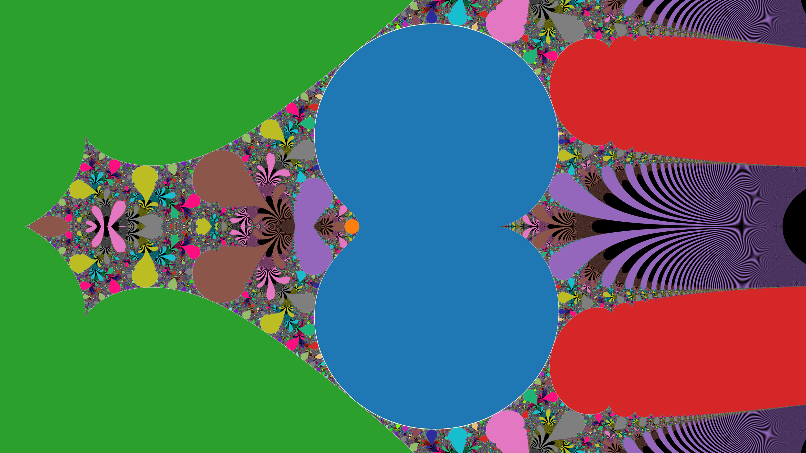

Power Tower
===========

Some code for producing a visualization for the infinite power tower x^x^x^x^... for initial points in the complex plane.

Some points diverge to infinite modululus (the black fractal). Some converge (blue). Some reach a cycle with periodicity 2 (orange), periodicity 3 (green), 4 (red), and so on. Periodicities up to 30 are coloured.

